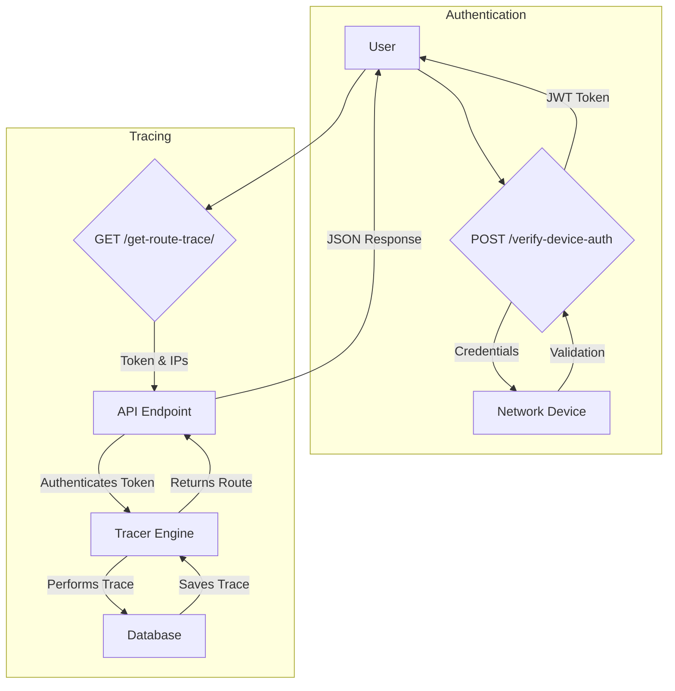
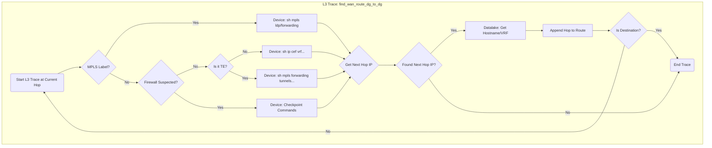
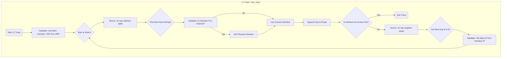

# Route Trace API


The **Route Trace API** is a powerful and intelligent network analysis tool designed to provide detailed, end-to-end network path tracing. Built with Python and FastAPI, it goes beyond a simple `traceroute` by integrating with your entire network ecosystem, including a Trino datalake, Tufin SecureTrack, and live network devices, to provide a comprehensive view of both Layer 2 and Layer 3 paths.

---

## 🚀 Key Features

*   **Hybrid Data Sourcing**: Combines real-time data from network devices (Cisco, Checkpoint) with historical data from a Trino datalake and topology information from Tufin for maximum accuracy.
*   **End-to-End Path Analysis**: Performs both Layer 2 (MAC-based) and Layer 3 (IP-based) tracing to give a complete picture of the network path.
*   **Intelligent Parsing**: Leverages an external AI service to dynamically parse unstructured text output from device commands, ensuring compatibility and robustness.
*   **Firewall & MPLS Awareness**: Intelligently handles complex network scenarios, including Checkpoint firewalls, MPLS labels, and Traffic-Engineered tunnels.
*   **RESTful & Asynchronous**: A modern API built on FastAPI, offering high performance and automatic interactive documentation (via Swagger UI).
*   **Persistent History**: Saves every trace to a database, creating a searchable history of network paths that can be reviewed and analyzed.
*   **Secure**: Protects endpoints using JWT-based authentication, with a clever mechanism that validates credentials against live network devices.

---

## 🏛️ Architecture Overview

The application is designed with a modular architecture that separates concerns, making it scalable and easy to maintain.

1.  **FastAPI Core (`app.py`)**: The main entry point that serves the API. It includes all the routers that define the available endpoints.
2.  **API Routers (`/routers`)**: Defines all API endpoints for authentication, route tracing, and historical data retrieval. It handles request validation and authentication checks.
3.  **The Tracer (`/tracer`)**: This is the brain of the operation. The `Tracer` class orchestrates the entire tracing process. It decides whether to query the datalake, connect to a live device, or consult Tufin based on the current hop's context.
4.  **Data Sources**:
    *   **Trino Datalake (`/tracer/routetrace/FromDatabase.py`)**: Used as the primary source for historical network state, such as ARP tables, CDP neighbors, and interface configurations. This reduces the load on live devices.
    *   **Live Devices (`/tracer/routetrace/FromDevices.py`)**: When real-time information is needed, the tracer connects directly to switches, routers, and firewalls using Paramiko (for Cisco) and Netmiko (for Checkpoint).
    *   **Tufin SecureTrack (`/Tufin/Tufin.py`)**: Used to query firewall topology and understand routing through complex firewall policies.
5.  **Database (`/database`)**: Uses SQLAlchemy to interact with a database (configured for MySQL). It stores user information and every route trace result for historical analysis.
6.  **AI Parser (`/AI_parser`)**: A client that sends raw text from device commands to an external microservice, which returns structured data. This makes the tool adaptable to different OS versions and command outputs.

## Workflow & Logic

The power of the Route Trace API comes from its intelligent, multi-source data correlation. The diagrams below illustrate the application's flow, from a user request to the detailed logic inside the tracer engine.

### High-Level API Flow

This diagram shows the typical user journey when interacting with the API.



### Tracer Engine Logic

This diagram details the decision-making process inside the `Tracer` class as it builds the route, hop by hop. It showcases how the engine prioritizes different data sources to build an accurate path.

#### Layer 3 (WAN) Trace



#### Layer 2 (LAN) Trace




---

## 🔧 Setup & Installation

Follow these steps to get the Route Trace API running in your environment.

### Prerequisites

*   Python 3.9+
*   Access to a MySQL database (or modify `database/models.py` for another backend like SQLite).
*   Network connectivity to your Trino Datalake, Tufin instance, network devices, and the AI Parser service.

### 1. Clone the Repository

```bash
git clone <your-repo-url>
cd route-trace-api
```

### 2. Install Dependencies

It's recommended to use a virtual environment.

```bash
python -m venv venv
source venv/bin/activate  # On Windows, use `venv\Scripts\activate`
pip install fastapi uvicorn "sqlalchemy[mysqlclient]" "python-jose[cryptography]" passlib jwt paramiko netmiko trino requests
```

### 3. Configure the Application

This project has been stripped of sensitive credentials. You must configure them manually in the following files:

*   **Database Connection**:
    *   In `database/models.py`: Update the `create_engine` connection string with your database credentials.
*   **Device & Service Credentials**:
    *   In `tracer/routetrace/FromDevices.py`: Set the `dev_user`, `dev_pass`, and firewall credentials.
    *   In `tracer/routetrace/trino_connect.py`: Set the Trino username and password.
    *   In `Tufin/Tufin.py`: Set the SecureTrack API credentials.
*   **Service IPs**:
    *   In `AI_parser/parser.py`: Set the `assistant_host` IP address.
    *   In `app.py`: Set the host IP address for `uvicorn.run`.
*   **Authentication Secret**:
    *   In `routers/auth.py`: It is highly recommended to replace the hardcoded `secret_hex` with a securely generated secret using `secrets.token_hex(32)`.

### 4. Run the Server

Once configured, you can start the API server using Uvicorn.

```bash
uvicorn app:app --host 0.0.0.0 --port 7000 --reload
```

The `--reload` flag is for development and automatically restarts the server on code changes.

---

## 📖 API Documentation

The API provides interactive documentation. Once the server is running, navigate to:

*   **Swagger UI**: `http://<your-server-ip>:7000/docs`
*   **ReDoc**: `http://<your-server-ip>:7000/redoc`

### Authentication

First, you must obtain a JWT token by authenticating with credentials that are valid on your network devices.

#### `POST /verify-device-auth`

Verifies user credentials against a network device. If successful, it adds the user to the database and returns a JWT token. This token must be included in the `token` header for all subsequent requests.

**Request Body:**

```json
{
  "username": "your-device-username",
  "password": "your-device-password"
}
```

**Successful Response (200 OK):**

```json
"eyJhbGciOiJIUzI1NiIsInR5cCI6IkpXVCJ9..."
```

---

### Endpoints

#### `GET /get-default-gateway/`

Finds the default gateway for a given endpoint IP.

*   **Query Parameters**: `ip` (string, required)
*   **Headers**: `token` (string, required)

#### `GET /get-mac-trace/`

Performs a Layer 2 trace from an endpoint to its default gateway to identify the switch path.

*   **Query Parameters**:
    *   `ip` (string, required): The source endpoint IP.
    *   `dg` (string, optional): The default gateway IP. If not provided, it will be discovered automatically.
*   **Headers**: `token` (string, required)

**Example Response:**

```json
[
    {
        "ip": "10.10.10.1",
        "id_": "core-switch-01",
        "destination_mac": "aabb.cc00.0100",
        "next_hop_int_ip": "10.20.20.2",
        "next_hop_interface": "TenGigabitEthernet1/0/1",
        "type": "switch",
        "hop": 1
    },
    ...
]
```

#### `GET /get-route-trace/`

Performs a full Layer 3 trace between two IP addresses.

*   **Query Parameters**:
    *   `source_ip` (string, required)
    *   `destination_ip` (string, required)
    *   `source_dg` (string, required): The default gateway of the source IP.
    *   `destination_dg` (string, required): The default gateway of the destination IP.
*   **Headers**: `token` (string, required)

**Example Response:**

```json
[
    {
        "ip": "10.10.10.1",
        "destination_network": "20.20.20.20",
        "vrf": "CUSTOMER_VRF",
        "destination_dg_ip": "20.20.20.1",
        "mpls_label": "12345",
        "nexthop_int_ip": "10.0.0.2",
        "passed_firewall": false,
        "type": "router",
        "hostname": "core-router-01",
        "hop": 1
    },
    ...
]
```

#### `GET /get-search-routes`

Retrieves a paginated and searchable list of your previously traced routes.

*   **Query Parameters**:
    *   `search_string` (string, optional): Filters routes where the source or destination contains this string.
    *   `route_type` (string, optional): "Layer2" or "Layer3".
    *   `limit` (string, optional, default: 10)
    *   `page` (string, optional, default: 1)
*   **Headers**: `token` (string, required)

#### `GET /get-route-by-id/{route_id}`

Retrieves a single saved route trace by its unique database ID.

*   **Path Parameters**: `route_id` (integer, required)
*   **Headers**: `token` (string, required)

#### `POST /delete-route`

Deletes the most recent route trace between a source and destination.

**Request Body:**

```json
{
  "source_ip": "10.10.10.10",
  "destination_ip": "20.20.20.20"
}
```
